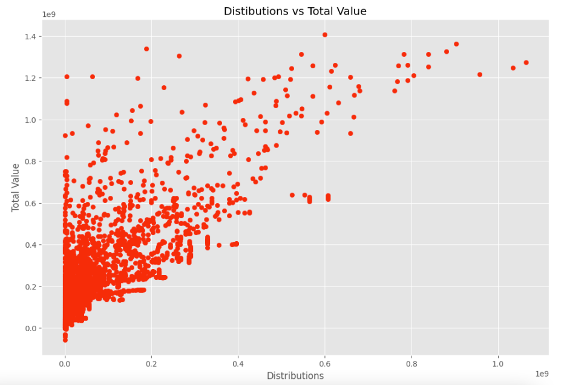
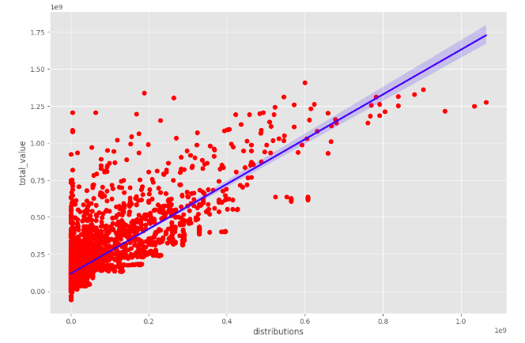
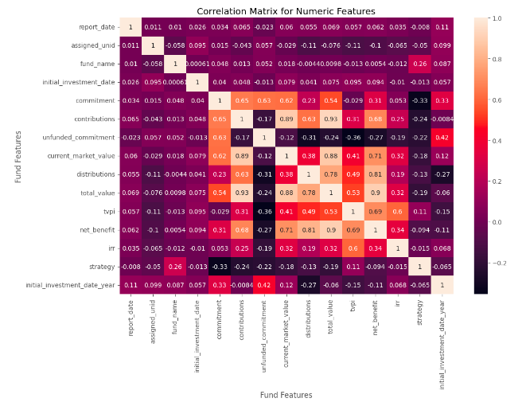

# Private Equity Data Analysis

## Table of Contents
- [Business Problem](#business-problem)
  * [Objective](#objective)
  * [Goal](#goal)
- [Data Source](#data-source)
- [Methods](#methods)
- [Tech Stack](#tech-stack)
- [Preliminary Analysis](#preliminary-analysis)
- [Quick Analysis of Results](#quick-analysis-of-results)
  * [Key Findings](#key-findings)
  * [Limitations and Suggestions](#limitations-and-suggestions)
- [Installation: Simplify Your Analysis](#installation-simplify-your-analysis)
  * [Run Locally in Jupyter Notebook](#run-locally-in-jupyter-notebook)

## Business Problem
A private equity firm has amassed a substantial dataset. They need to extract valuable insights from it to inform their investment decisions. However, the dataset is vast and complex, making it challenging to identify meaningful patterns and relationships. They require a comprehensive data exploration and analysis approach to uncover valuable information hidden within the dataset.

### Objective
The objective of this project is to perform a thorough data exploration and analysis of the private equity dataset to gain a deeper understanding of the investment landscape and to understand how it differs from the current macro-economic climate. By leveraging various techniques such as filtering, correlation coefficient analysis, data visualization, and data transformation, the aim is to extract meaningful insights that can guide our investment strategies.

### Goal
My goal is to:
- Explore data dimensions and variables, applying filtering techniques to identify subsets aligning with investment criteria and uncover hidden patterns and trends.
- Calculate correlation coefficients using the Pearson method, identifying significant correlations between continuous variables for insights into investment opportunities and risks.
- Visualize data through scatter plots, revealing feature relationships and detecting patterns or outliers. Create a correlation matrix for numeric features to understand interrelationships.
- Perform data transformation, normalizing by converting floating-point values to integers for consistent and comparable analysis. Unstack the correlation matrix for a tabular format, facilitating easier interpretation.

## Data Source

[Kaggle link to Private Equity Data Q1 2009 to Q2 2021](https://www.kaggle.com/datasets/jblumenstein/wsib-private-equity-data-q1-2009-to-q2-2021)

## Methods
- Data Exploration
  * Filtering
- Correlation Coefficient
  * Pearson Correlation: This method calculates the linear relationship between two continuous variables. It measures the strength and direction of the linear association between the variables, ranging from -1 to 1. 
- Data Visualization
  * Scatter plots
  * Correlation Matrix for Numeric Features
- Data Transformation
  * Converting floats to integers to normalize the data
  * Unstacking the Correlation Matrix containing Numeric Features

## Tech Stack
- Google Colab

## Preliminary Analysis
### Data Transformation
Performed data transformations as needed, such as converting floating-point values to integers to ensure consistency and ease of comparison across variables. Unstacked the correlation matrix to transform it into a tabular format, enabling easier analysis and interpretation.

### Correlation Analysis 
Utilized the Pearson correlation coefficient to measure the strength and direction of linear relationships between continuous variables. Identified features that exhibit significant correlations, which can offer insights into potential investment opportunities and risks.

### Data Visualization
- Created visual representations of the data using scatter plots to observe relationships between variables. Visualized the correlation matrix for numeric features to gain a comprehensive overview of interrelationships. This visual exploration can provide initial insights and highlight potential trends or outliers.

## Quick Analysis of Results
### Key Findings
#### Scatter Plot

#### Correlation Matrix for Numeric Features

### Limitations and Suggestions
#### Limitations of Scatter Plots
- Limited to Two Variables: Scatter plots can only visualize the relationship between two variables at a time. If you have a dataset with multiple variables, you would need to create multiple scatter plots to explore relationships between different pairs of variables.
- Non-linear Relationships: Scatter plots are most effective at capturing linear relationships between variables. They may not accurately represent non-linear or complex relationships, potentially leading to misleading interpretations.
- Lack of Contextual Information: Scatter plots typically focus on the relationship between variables but may lack contextual information such as time, categories, or other factors that could influence the relationship. This limitation can limit the depth of analysis.

#### Limitations of Correlation Matrices
- Limited to Numerical Variables: Correlation matrices are primarily used to analyze the relationship between numerical variables. They may not be applicable or informative for categorical or ordinal variables.
  * I had assumed by converting the non-numeric objects to numeric data types might help to display a new relationship in the results but the findings did not provide evidence in support of my initial hypothesis.
- Assumes Linear Relationships: Correlation coefficients, such as the Pearson correlation, assume linear relationships between variables. If the relationship is non-linear or the data distribution is not symmetric, the correlation coefficient may not accurately capture the true relationship.
- Lack of Causation: Correlation measures the strength and direction of the relationship between variables but does not establish causation. A high correlation does not necessarily imply a causal relationship, as other confounding factors may be at play.

#### Future Suggestions
- Statistical Analysis: I will look to employ a wider range of statistical techniques to explore relationships and patterns in my data. This could include regression analysis, ANOVA (analysis of variance), chi-square tests, time series analysis, clustering algorithms, or predictive modeling. 
- Feature Engineering: I may look to create new features or variables from existing data to capture additional insights. Transformations, aggregations, or creating derived variables can provide a deeper understanding of the underlying patterns and relationships in your dataset.
- Data Enrichment: I will look to augment existing dataset with additional relevant data sources to gain a broader perspective. External data, such as economic indicators, demographic information, or industry-specific data, can provide valuable context and enhance the depth of analysis.
- Advanced Machine Learning Techniques: Consider applying advanced machine learning algorithms to identify complex patterns or make predictions. Techniques such as decision trees, random forests, support vector machines, or neural networks can uncover hidden relationships and generate more accurate predictions.

## Installation: Simplify Your Analysis

### Run Locally in Jupyter Notebook
